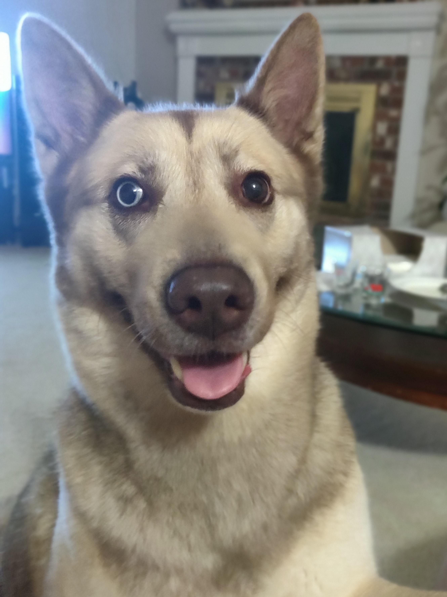

# **Jonny Le**

DevOps Engineer

---
# **What do you do here?**

### Ideally

### Reality

---
# **Motivation, Opportunities, Challenges**

* Problem-solving
* Learning
* Money

---

# **Personal Investments**

---
# **Professional Accomplishment / Value**

[PRTG Test Drive](https://github.com/CC-Digital-Innovation/prtg-test-drive)

- Demo PRTG instances
- Self-service
- Automated
- HTTPS
- Container and Dockers

---
# **Reflection**

#### Worked well?
* Extra time reading

#### Didn't work well?
* Not communicating

#### Do differently?
* Ask more questions and communicate

#### New outcome?
* Better programs, more feedback

---
<!--
_class: lead
-->
# **Future Investments**

## Certified Kubernetes Administrator (CKA)
